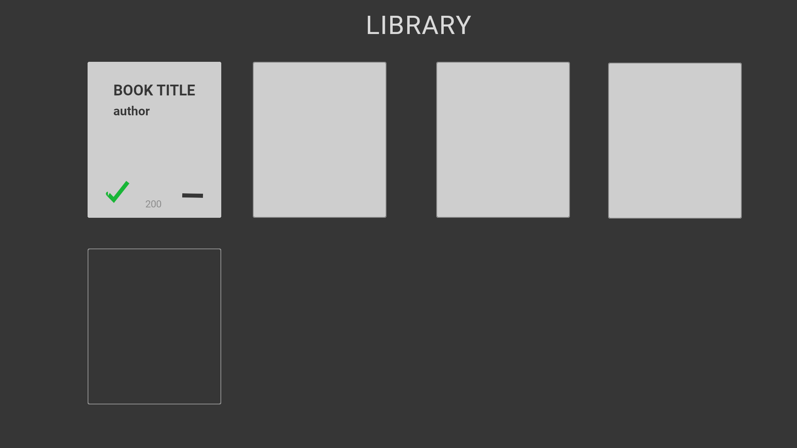

# Project: Library

Library project as part of The Odin Project curriculum

## Problem solving

### Understand

#### Input Requirements

- Allow user to add a book
	- Accept the following data:
		- Title
		- Author
		- Number of pages
		- Read?
- Allow user to remove a book
- Allow user to mark a book as read

#### Output Requirements

- Section for all books
	- Book
		- Button to remove
		- Button to mark read
- Button to add book
	- User input fields for:
		- Title 
		- Author
		- Number of pages
		- Read?

### Plan

#### Todo

- [x] Create a design  
- [x] Gather assets
  - [x] Icons from pic (by purpose)
    - [x] Logo
    - [x] Trash
    - [x] Author
    - [x] Title
    - [x] Number of pages
    - [x] Read / unread
    - [x] Add / remove book
  - [x] Roboto font

- [x] Create `script.js`
	- [x] Add book constructor and book array
	- [x] Add function to add book to array
	- [x] Add function to remove book
	- [x] Add function to toggle read
	- [x] Create book DOM node
	- [x] Template elements to dynamically append to DOM
	- [x] Add form
- [x] Create `index.html`
	- [x] Add HTML boilerplate, link stylesheet and script
	- [x] Add "Add Book" button
		- [x] Add form for user input
			- [x] Add author text field
			- [x] Add title text field
			- [x] Add number of pages integer field
			- [x] Add read checkbox
			- [x] Add submit button
	- [x] Structure HTML for DOM manipulation
		- [x] Container for book DOM nodes
			- [x] Add "Toggle Read" action
			- [x] Add "Remove book" action
- [x] Create `style.css`
	- [x] Add boilerplate / resets
	- [x] Add broad-strokes styling
<<<<<<< HEAD
	- [x] Refine styles
=======
	- [x] Refine styles
>>>>>>> f52eeaca03136207d3465b240c1d5de4c8f66fe1
